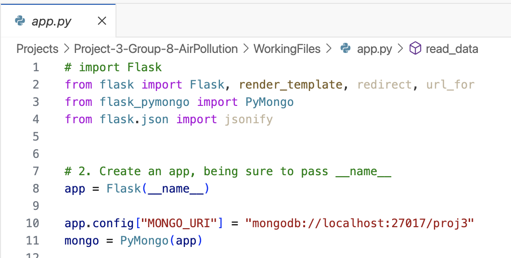
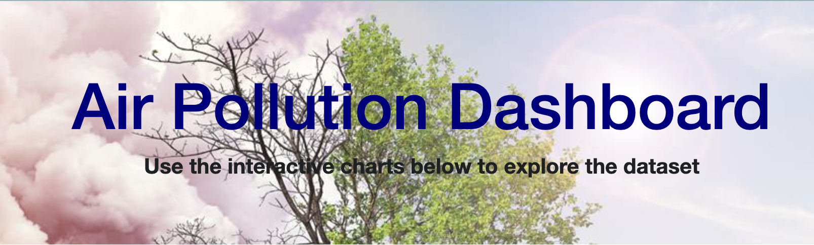
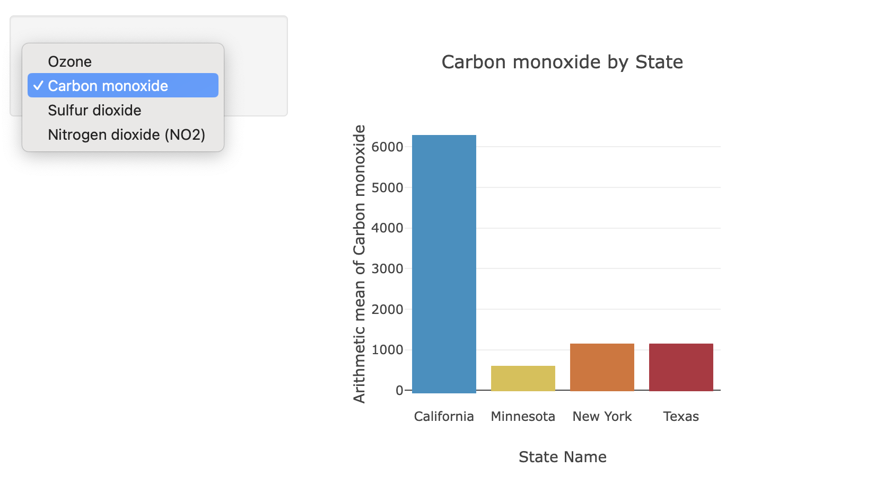
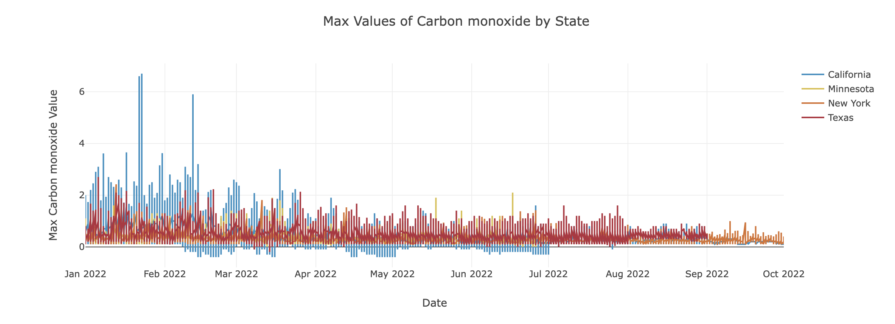
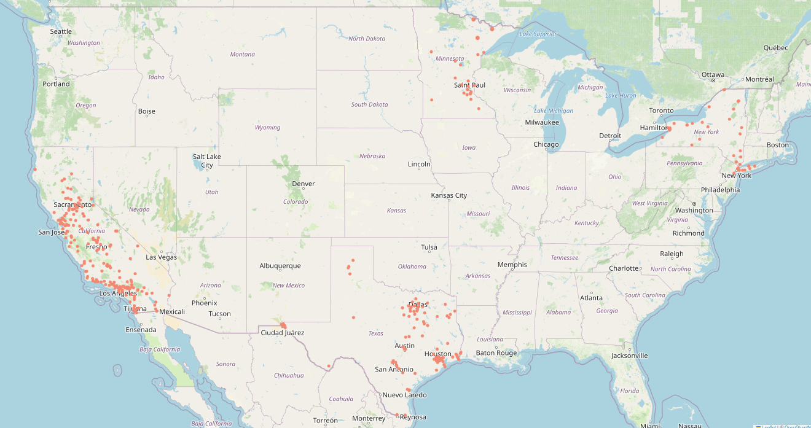
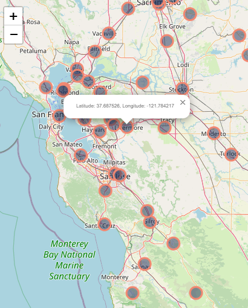

# Project-3-Group-8-AirPollution

## Group Members:
 - Angelina Vang
 - Brian Guenther
 - Jovid Rajab
 - Lori Andler

## Project Overview
Our initial project proposal was to review air pollutants from a Kaggle dataset and the Enviromental Protection Agency (EPA)'s API of air pollution data.  We pulled data from both sites and found there to be so many rows of data that we were going to run into size constraints.

Through our data clean up and scraping process and in order to get the data into a small enough size for our git hub progress, we ended up going from over 2000 Air Pollution Parameters from from sites across all 50 of the United States for over 40 years down to 8 pollutants, 4 states and 3 years of data.  Even this was a large amount of data.  

Most of our time during class work time was spent retrieving the data and scraping it to a reasonable size that could be used to work on the data. We continued to scrape the data and ended up feeding our data into a mongo database and reporting on:

<u>**Four Pollutants**</u>
1. Carbon Monoxide
2. Nitrogen Dioxide
3. Ozone
4. Sulfur Dioxide

<u>**Four States**</u>
1. California
2. Minnesota
3. New York
4. Texas

<u>**Time Span**</u>
The data is from the year 2022.

## Requirements
Our project includes a <u>Mongo Database (proj3)</u> which is referenced in our app.py file.

We used a <u>Python Flasked-powered Java Script</u> to create a <u>dashboard page</u> with multiple charts from the data.  

The <u>dropdown</u> on our dashboard allows you to select one of the four Pollutants.  The selection shows a <u>Bar Chart</u> with the mean anount of that air pollutant per the four states in 2022.  

The <u>Line Chart</u> shows the max values per day in 2022 of the air pollutant selected in each of the four states giving you a visualization to compare the amounts per state across the year.

We used plotly to create the bar and line charts and we used leaflet to create our map.  The map contains markers for the unique sites that provided data on the pollutants and our markers display the latitude and longitude of that site.

## References/Sites Used:
- Kaggle.com 
    - US Pollution 2000-2021 data set: Carbon Monoxide, Nitrogen Dioxide, Ground-Level Ozone, and Sulfur Dioxide pollution data in the USA between 2000-2021 from the EPA
    - https://www.kaggle.com/datasets/alpacanonymous/us-pollution-20002021 
- US Environmental Protection Agency API:
    - https://aqs.epa.gov/aqsweb/documents/data_api.html 
- https://www.geeksforgeeks.org/python-get-values-of-particular-key-in-list-of-dictionaries/
- Picular (https://picular.co/): Assistance on color choices
- https://stackoverflow.com/questions/40744027/using-pandas-read-csv-with-zip-compression & https://pandas.pydata.org/pandas-docs/stable/reference/api/pandas.read_csv.html : Assistance on webscraping

## Future Work:
If we had more time to work on the project, here are a few things we would've liked to have looked into further:
- Being able to map out more pollutants and/or more states
- Map out over time to see a trend over years
- Add a horizontal bar to the charts to show when the levels are above the “danger levels”
- Change markers so radius changes with pollutant concentration value
- Try to map out whether sites are in urban or rural areas and compare the differences

## Acknowledgements:
### Thank you to everyone that helped us out on this project with their expertise!
- Tutors:
    - Leimei Hour - for helping sort data, guiding the panda data frame creation & assisting in setting up functions for our first bar chart data visualization
    - Steven Thomas
    - Kourt Bailey - guiding webscraping of compressed files
- Instructor & TA's:
    - Hunter Hollis
    - Randy & Sam
